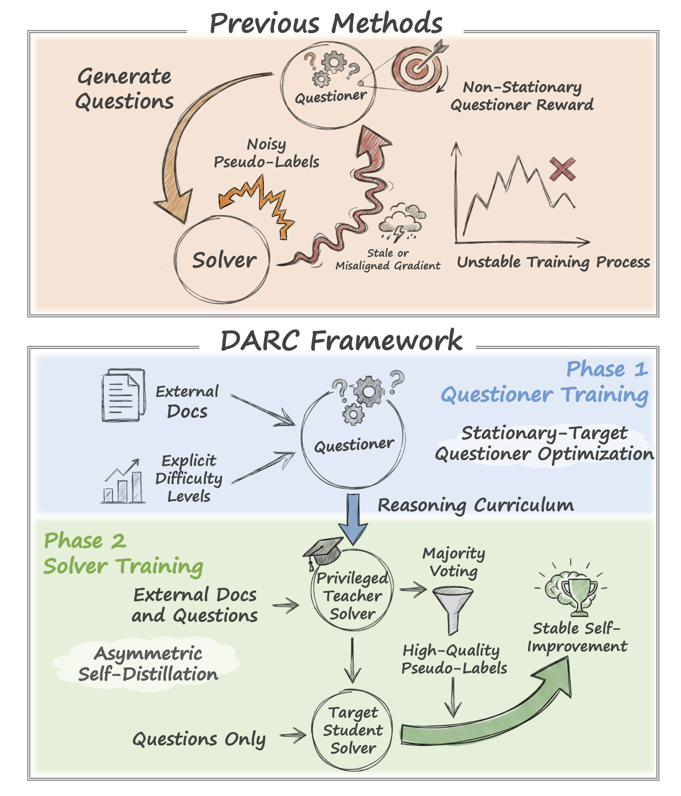
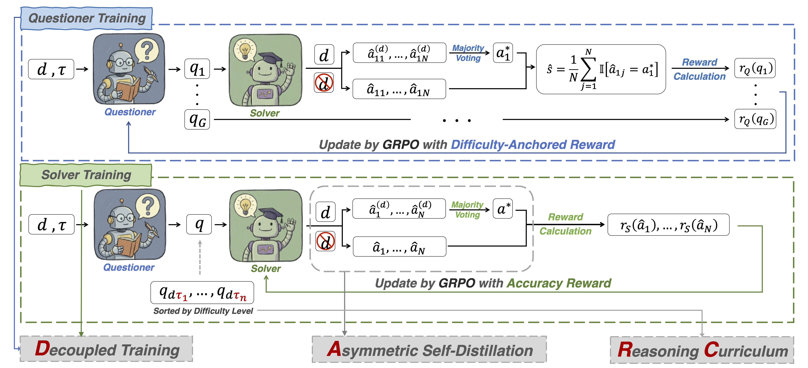

# *DARC : Decoupled Asymmetric Reasoning Curriculum for LLM Evolution*

Self-play with large language models has emerged as a promising paradigm for achieving self-improving artificial intelligence.  
However, existing self-play frameworks often suffer from optimization instability, due to (i) non-stationary objectives induced by solver-dependent reward feedback for the *Questioner*, and (ii) bootstrapping errors from self-generated pseudo-labels used to supervise the *Solver*.

To mitigate these challenges, we introduce **DARC** (**D**ecoupled **A**symmetric **R**easoning **C**urriculum), a two-stage framework that stabilizes the self-evolution process.  
First, we train the *Questioner* to synthesize difficulty-calibrated questions, conditioned on explicit difficulty levels and external corpora.  
Second, we train the *Solver* with an asymmetric self-distillation mechanism, where a document-augmented teacher generates high-quality pseudo-labels to supervise the student *Solver* that lacks document access.

Empirical results demonstrate that **DARC** is model-agnostic, yielding an average improvement of **10.9** points across nine reasoning benchmarks and three backbone models. Moreover, **DARC** consistently outperforms all baselines and approaches the performance of fully supervised models without relying on human annotations.

<div align="center">
  
</div>

## 👀 Overview

DARC replaces tightly coupled self-play with a decoupled, two-stage pipeline:

1. **Stage 1 (Questioner Training):** Train the Questioner on external documents with explicit difficulty targets, using grounding + difficulty alignment rewards.
2. **Stage 2 (Solver Training):** Freeze the Questioner, build an offline curriculum (easy → hard), and train the Solver via asymmetric self-distillation (document-augmented teacher + majority voting → question-only student).


<div align="center">
  
</div>

## 🌟 Key Features

- Decoupled two-stage training that stabilizes self-evolution.
- Difficulty-aware Questioner conditioned on explicit difficulty levels and external documents, with grounding and difficulty alignment rewards.
- Asymmetric self-distillation for the Solver: document-augmented teacher with majority voting supervises a question-only student to reduce label noise.
- Offline curriculum ordered from easy to hard based on target difficulty, producing solver-independent difficulty rankings.
- Fully self-supervised (no human annotations) and model-agnostic, with consistent gains across multiple backbones and benchmarks.

## 📃 Repository Layout

- `scripts/`: entrypoints for the two-stage training.
- `question_generate/`: vLLM-based question generation workers and batch drivers.
- `question_evaluate/`: answer grading, filtering, and solver dataset assembly.
- `evaluation/`: benchmark runners and result recheck utilities.
- `examples/`: configs, prompts, reward functions, and preprocessing pipelines.
- `vllm_service_init/`: vLLM server launch scripts and templates.
- `verl/`: RL training engine (vendored).
- `data/`: small example datasets for format sanity checks.


## 🧩 Setup 

### 1. Install dependencies 

```bash
pip install -r requirements.txt
```

### 2. Environment variables 

The training scripts read paths and IDs from env vars. These are enough to run the two-stage DARC pipeline (Questioner → Solver) described in the paper. Required for `scripts/main.sh` and the training shells:

```bash
export STORAGE_PATH="$YOUR_STORAGE_PATH"    
# checkpoints/datasets/eval outputs
export PROJECT_ROOT="$(pwd)"   # repo root for PYTHONPATH
export HUGGINGFACENAME="$YOUR_HF_NAMESPACE" # required by training shells
```

Optional (only if you use HF/W&B):

```bash
export HF_TOKEN="$YOUR_HF_TOKEN"
export SWANLAB_API_KEY="$YOUR_SWANLAB_API_KEY"
```

OpenAI-compatible evaluators/filters (only if you run API-based recheck or filters):

```bash
export API_KEY="$YOUR_API_KEY"
export API_BASE_URL="https://api.openai.com/v1"  # or your gateway
```

Set `challenger_data_path` for challenger's difficulty-aware training (optional):

```bash
export CHALLENGER_DATA_PATH="$PATH_TO_CORPUS"
```

## ⚡️ Getting Started
Make sure the env vars in **Setup** are configured first.

### 1) Train the difficulty-aware Questioner

```bash 
bash scripts/difficulty_aware_questioner_train.sh \
  /path/to/solver_model \  
  /path/to/questioner_model \  
  experiment_name_v1 \          
  /path/to/dataset.parquet      
```

Arguments:
- arg1: solver model path (used by the vLLM service to evaluate question difficulty).

- arg2: initial questioner model path (the Actor model being trained).

- arg3: experiment name (checkpoint folder under "$STORAGE_PATH/models").

- arg4: training dataset path (parquet file containing the context/prompts).

### 2) Generate solver datasets (from the trained Questioner)

This step involves two parts: first, serving the trained Questioner model using vLLM, and second, running the generation script to produce the training data for the Solver.

#### Step 1: Start vLLM Service for the Questioner

Launch the Questioner model as an API server.

```bash
# Set your model path and GPU configuration
export QUESTIONER_MODEL_PATH=/path/to/your/trained_questioner_model
export CUDA_VISIBLE_DEVICES=4,5,6,7  # Adjust based on available GPUs

nohup env CUDA_VISIBLE_DEVICES=$CUDA_VISIBLE_DEVICES \
  vllm serve "$QUESTIONER_MODEL_PATH" \
  --served-model-name questioner \
  --max-model-len 32768 --tensor-parallel-size 4 \
  --port 6000 --api-key my_secure_key --gpu-memory-utilization 0.9 --disable_cascade_attn \
  > vllm_questioner_service.log 2>&1 &
```

Notes:
- `--base_url` should point to one of the local vLLM servers started in step 2.
- The script also uses `API_KEY`/`API_BASE_URL` for judge calls (filtering), so keep those set.


### 3) Train the difficulty-aware Solver

Run the training script for the solver using the generated dataset.

```bash
# Set model and dataset paths
export BASE_MODEL_PATH=/path/to/base_model
export SOLVER_DATASET=/path/to/solver_dataset.parquet
export EXPERIMENT_NAME=my_solver_experiment_v1

nohup bash scripts/difficulty_aware_solver_train.sh \
  "$BASE_MODEL_PATH" \
  "$SOLVER_DATASET" \
  "$EXPERIMENT_NAME" \
  > solver_train.log 2>&1 &
```
Arguments:

- arg1: Base model path for the solver.

- arg2: Path to the solver training dataset (parquet file).

- arg3: Experiment name (used for saving checkpoints under $STORAGE_PATH/models).

## 📊 Experiment Results

DARC consistently improves the base models and achieves the best overall averages among label-free methods, outperforming [R-Zero](https://arxiv.org/abs/2508.05004), [Absolute Zero](https://arxiv.org/abs/2505.03335), and [SPICE](https://arxiv.org/html/2510.24684v1) on both math and general reasoning across Qwen3 and OctoThinker backbones. It also matches or exceeds the weakly supervised [R-Few](https://arxiv.org/abs/2512.02472) (1%) in overall average on Qwen3 backbones, while using **zero** human annotations. General-Reasoner is shown as a supervised reference and is not directly comparable due to its different supervision regime.

| Model | Method | AMC | Minerva | MATH | GSM8K | Olympiad | Math Avg. | MMLU Pro | Super GPQA | GPQA Diamond | BBEH | General Avg. | Avg. |
|---|---|---:|---:|---:|---:|---:|---:|---:|---:|---:|---:|---:|---:|
| Qwen3-4B-Base | General-Reasoner | 60.0 | 57.7 | 80.6 | 92.2 | 47.7 | 67.6 | 62.8 | 32.5 | 42.9 | 12.2 | 37.6 | 54.3 |
| Qwen3-4B-Base | Base Model | 47.5 | 42.3 | 68.2 | 72.6 | 34.8 | 53.1 | 51.6 | 25.4 | 26.3 | 8.1 | 27.9 | 41.9 |
| Qwen3-4B-Base | + R-Zero | 48.2 | 51.2 | 74.8 | 90.6 | 40.6 | 61.1 | 54.2 | 27.8 | 36.4 | 10.4 | 32.2 | 48.2 |
| Qwen3-4B-Base | + Absolute Zero | 50.0 | 41.9 | 76.2 | 89.3 | 41.5 | 59.8 | 52.6 | 27.1 | 35.3 | 8.3 | 30.8 | 46.9 |
| Qwen3-4B-Base | + SPICE | 50.9 | 55.5 | **77.9** | 91.9 | 41.9 | 63.6 | 56.5 | 28.3 | 37.9 | **11.3** | 33.5 | 50.2 |
| Qwen3-4B-Base | + R-Few (1%) | 52.7 | 52.1 | 77.8 | **92.3** | 42.4 | 63.5 | 55.9 | **29.4** | 35.4 | 11.2 | 33.0 | 49.9 |
| Qwen3-4B-Base | + **DARC (Ours)** | **60.3** | **57.7** | 77.6 | 91.9 | **45.8** | **66.7** | **56.9** | 29.2 | **38.9** | 11.2 | **34.1** | **52.2** |
| Qwen3-8B-Base | General-Reasoner | 64.8 | 62.6 | 83.4 | 92.7 | 46.3 | 70.0 | 65.1 | 35.3 | 42.9 | 10.8 | 38.5 | 56.0 |
| Qwen3-8B-Base | Base Model | 61.5 | 49.3 | 74.4 | 90.9 | 40.4 | 63.3 | 58.0 | 30.4 | 33.3 | 10.5 | 33.1 | 49.9 |
| Qwen3-8B-Base | + R-Zero | 62.8 | 58.8 | 80.6 | 92.4 | 43.4 | 67.6 | 61.6 | 31.8 | 40.5 | 11.3 | 36.3 | 53.7 |
| Qwen3-8B-Base | + Absolute Zero | 62.5 | 52.9 | 76.6 | 92.0 | 47.8 | 66.4 | 62.5 | **33.5** | 36.8 | 10.8 | 35.9 | 52.8 |
| Qwen3-8B-Base | + SPICE | 60.9 | 55.2 | 81.4 | 93.8 | 48.0 | 67.9 | 61.0 | 32.4 | 40.4 | **12.1** | 36.5 | 53.9 |
| Qwen3-8B-Base | + R-Few (1%) | **69.3** | 59.6 | 81.6 | **94.0** | 44.0 | 69.7 | **62.8** | 32.7 | 40.4 | 11.8 | 36.9 | 55.1 |
| Qwen3-8B-Base | + **DARC (Ours)** | 68.9 | **61.4** | **83.0** | **94.0** | **48.4** | **71.1** | 62.3 | 32.8 | **44.4** | 11.8 | **37.8** | **56.3** |
| OctoThinker-8B-Hybrid-Base | Base Model | 27.5 | 22.1 | 44.2 | 68.6 | 16.7 | 35.8 | 14.7 | 11.4 | 15.7 | 0.6 | 10.6 | 24.6 |
| OctoThinker-8B-Hybrid-Base | + R-Zero | 32.5 | 33.1 | 58.4 | 85.2 | 22.6 | 46.4 | 37.4 | 17.9 | 21.7 | 7.8 | 21.2 | 35.2 |
| OctoThinker-8B-Hybrid-Base | + Absolute Zero | 32.5 | 34.9 | 56.8 | 87.0 | 25.6 | 47.4 | 31.4 | 18.8 | 27.8 | 5.0 | 20.8 | 35.5 |
| OctoThinker-8B-Hybrid-Base | + SPICE | **35.2** | 40.8 | 58.4 | 87.3 | 25.6 | 49.5 | 41.3 | 19.9 | 29.8 | 7.2 | 24.5 | 38.4 |
| OctoThinker-8B-Hybrid-Base | + **DARC (Ours)** | 31.9 | **43.0** | **62.4** | **88.0** | **30.7** | **51.2** | **43.8** | **22.3** | **32.3** | **10.8** | **27.3** | **40.6** |

## 🙏 Acknowledgements

Our code framework is modified from [R-Zero](https://github.com/Chengsong-Huang/R-Zero). We are grateful for their excellent work.
